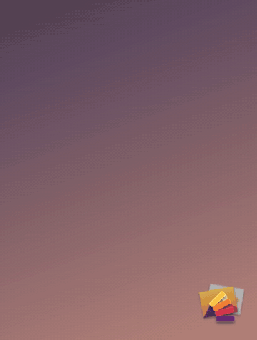

<p align="center">
  
</p>

<h1 align="center">Stash</h1>

<p align="center">A macOS-style Downloads stack for the Windows desktop.</p>

<p align="center">
  <a href="../../releases/latest"></a>
  <a href="../../actions/workflows/ci.yml"></a>
  
</p>

<p align="center">
  
</p>

---

Stash shows your newest downloads as a small pile in the corner of the screen. Hover over the pile and the files fan out above it with their names, the way a Dock stack does on a Mac. Click a file to open it, or drag it into another app.

Stash is a single 0.9 MB exe written in Rust. The Windows compositor runs its animations, so they play at full frame rate while Stash itself does no work.

## What it does

- Shows the three newest files as a pile, using real thumbnails for photos, videos and documents.
- Fans out on hover. The folder you're viewing sits at the bottom of the fan, and clicking it opens the folder in Explorer.
- Opens a file on click and lets you drag it into any app. Right-click a file to show it in Explorer or move it to the Recycle Bin.
- Watches more than one folder. Add Screenshots, Desktop or any other folder, then scroll over the stack to switch between them.
- Bounces when a new file arrives, even in a folder you aren't viewing.
- Moves files you drop onto it into the folder you're viewing.
- Opens on top of your windows when you click its tray icon, and goes back behind them when it closes.
- Lets you choose the sort order, how many files to show, the icon size, the corner, and whether it starts when you sign in.

## Install

The easiest way is the Microsoft Store: [Stash: Downloads stack](https://apps.microsoft.com/detail/9PMVDZ3LZ490). The Store version updates itself and runs natively on both x64 and Arm PCs.

To install from GitHub instead:

1. Download `Stash-Setup-<version>.exe` from the [latest release](../../releases/latest).
2. Run it. It installs for your account only, so it doesn't ask for admin rights. It can also start Stash when you sign in.

Each release also has portable exes that run without installing: `Stash-<version>-portable.exe` for x64 PCs and `Stash-<version>-arm64-portable.exe` for Arm PCs.

The GitHub installer isn't code-signed, so Windows SmartScreen may warn you about it. Select **More info**, then **Run anyway**. The Store version doesn't show this warning, because Microsoft signs it.

To uninstall, open Settings, go to Apps, then Installed apps. Stash keeps your settings in `%APPDATA%\Stash`.

Stash needs Windows 10 version 1903 or later, or Windows 11.

### Keep the Stash icon on the taskbar

Windows hides new tray icons behind the arrow next to the clock. Move the Stash icon onto the taskbar so you can open the stack with one click from any app.

- Windows 11: open Settings, go to Personalization, then Taskbar, then Other system tray icons, and turn on Stash.
- Windows 10: open Settings, go to Personalization, then Taskbar, select "Select which icons appear on the taskbar", and turn on Stash.

You can also drag the icon out of the hidden-icons menu onto the taskbar.

## Using Stash

| To | Do this |
| --- | --- |
| Open the stack | Hover over it, click it, or click the tray icon |
| Open a file | Click it |
| Use a file in another app | Drag it out of the stack |
| Open the folder in Explorer | Click the folder at the bottom of the open stack |
| Switch folders | Scroll over the stack, or pick one under **Folders** in the right-click menu |
| Add or remove a folder | Right-click the stack or the tray icon and open **Folders** |
| Change settings | Right-click the stack or the tray icon |

## Build from source

You need [Rust](https://rustup.rs) (stable, MSVC toolchain) and the Windows SDK. The Visual Studio C++ build tools include the SDK.

```powershell
git clone https://github.com/frstycodes/stash.git
cd stash
cargo build --release
.\target\release\stash.exe
```

To build the installer, install [NSIS 3](https://nsis.sourceforge.io) with `winget install NSIS.NSIS` and run:

```powershell
.\installer\build.ps1
```

The script writes the installer to `dist\Stash-Setup-<version>.exe`.

### Debugging

Set these environment variables before starting `stash.exe`.

- `STASH_LOG=1` writes a log to `%TEMP%\stash.log`.
- `STASH_SLOW=5` plays every animation five times slower.
- `STASH_PIN_OPEN=1` keeps the stack open.
- `STASH_DEMO=<folder>;<folder>` shows those folders in place of yours, keeps the stack above every window, and saves no settings.
- `STASH_DEMO_SCRIPT="1.5:open;4:next;6:close"` plays a timed sequence in demo mode. Each step is a time in seconds after start and a command (`open`, `close`, `next` or `prev`). The demo GIF above was recorded this way.

## Releases

GitHub Actions builds and publishes every release.

- Every push and pull request runs [CI](.github/workflows/ci.yml), which builds the app, the installer and the Store bundle.
- Pushing a version tag such as `v0.3.0` runs [Release](.github/workflows/release.yml). It builds the installer, portable exes for x64 and Arm64, and a Store bundle with both architectures. It publishes them as a GitHub release with notes generated from the commits, then submits the bundle to the Microsoft Store as a new version.

To cut a release, run this from a clean `main` branch:

```powershell
.\installer\release.ps1 0.3.0
```

The script sets the version in `Cargo.toml`, commits, tags `v0.3.0` and pushes. The release appears on the [Releases page](../../releases) when the workflow finishes, usually within ten minutes. The Store update then goes through Microsoft's certification, which takes a few hours to three business days.

### Store publishing

The Store step needs four repository secrets from Partner Center. Until they exist, the workflow skips the Store step and still publishes the GitHub release.

| Secret | Where to find it |
| --- | --- |
| `STORE_SELLER_ID` | Partner Center, Account settings, Legal info (Seller ID) |
| `STORE_TENANT_ID` | Partner Center, Account settings, User management, Microsoft Entra applications |
| `STORE_CLIENT_ID` | Same page, after you create an Entra application with the Manager role |
| `STORE_CLIENT_SECRET` | Same application, under Keys (a new key) |

Add each one with `gh secret set <NAME>`, which asks for the value without echoing it.

The Store app's identity lives in [packaging/identity.json](packaging/identity.json), and `packaging/build-msix.ps1` builds the package.

## How it works

- Stash draws with Windows Composition (the Visual Layer). Each icon's position, tilt and size in the fan is an expression of one `Progress` value, and the compositor animates that value with a spring.
- Direct2D and DirectWrite draw the thumbnails, labels and folder badge.
- The Windows shell supplies thumbnails through `IShellItemImageFactory`, and runs drag-and-drop and file actions.
- The [`notify`](https://crates.io/crates/notify) crate watches folders with `ReadDirectoryChangesW`, so Stash never polls the disk.

## Privacy

Stash never connects to the internet and collects no data. See the [privacy policy](PRIVACY.md).

## License

Stash is source-available under the [PolyForm Noncommercial License 1.0.0](LICENSE.md).

You can read the code, use Stash, change it and share your changes, as long as you don't use it for a commercial purpose. Personal use, study, hobby projects, and use by charities, schools and public institutions are all allowed. For commercial use, [open an issue](https://github.com/frstycodes/stash/issues) to ask.

Copyright 2026 Sandesh Pandey.
